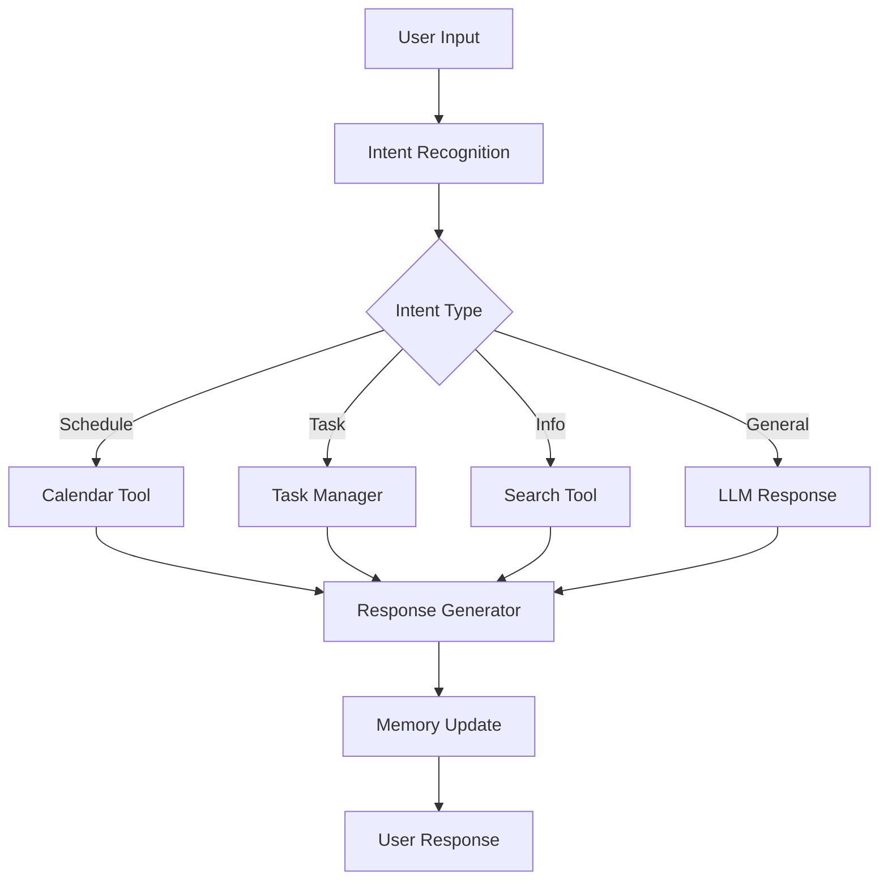

# Build a Personal Assistant with LangGraph4j

Create a sophisticated personal assistant that can handle multiple tasks, maintain context, and provide intelligent responses. This advanced tutorial shows you how to build a production-ready assistant using LangGraph4j.

## 🎯 What You'll Build

A personal assistant that can:
- **Schedule Management** - Add, view, and modify calendar events
- **Task Management** - Create and track to-do items
- **Information Retrieval** - Search and summarize information
- **Conversation Memory** - Remember context across interactions
- **Multi-step Reasoning** - Break complex requests into steps

## 🏗️ Architecture Overview



## 🔧 Core Components

### 1. Assistant State

```java
public class AssistantState {
    private final String userMessage;
    private final List<Message> conversationHistory;
    private final Map<String, Object> context;
    private String intent;
    private String action;
    private Object result;
    private String response;
    
    // Constructor and builder methods...
}
```

### 2. Intent Recognition Node

```java
public class IntentRecognitionNode implements Node<AssistantState> {
    
    private final ChatLanguageModel llm;
    
    @Override
    public AssistantState execute(AssistantState state) {
        String prompt = String.format("""
            Analyze the user's intent from this message: "%s"
            
            Possible intents:
            - schedule_management
            - task_management  
            - information_retrieval
            - general_conversation
            
            Return only the intent name.
            """, state.getUserMessage());
            
        String intent = llm.generate(prompt).content();
        return state.withIntent(intent);
    }
}
```

### 3. Tool Integration

```java
@Component
public class CalendarTool implements Tool {
    
    @Override
    public String name() {
        return "calendar";
    }
    
    @Override
    public String description() {
        return "Manage calendar events and appointments";
    }
    
    public String addEvent(String title, String date, String time) {
        // Implementation for adding calendar events
        return "Event '" + title + "' scheduled for " + date + " at " + time;
    }
    
    public String listEvents(String date) {
        // Implementation for listing events
        return "Events for " + date + ": [list of events]";
    }
}
```

## 🚀 Building the Workflow

```java
@Service
public class PersonalAssistant {
    
    private final Graph<AssistantState> workflow;
    
    public PersonalAssistant(ChatLanguageModel llm, List<Tool> tools) {
        this.workflow = Graph.builder()
            .addNode("recognize_intent", new IntentRecognitionNode(llm))
            .addNode("route_action", new ActionRoutingNode())
            .addNode("execute_tool", new ToolExecutionNode(tools))
            .addNode("generate_response", new ResponseGenerationNode(llm))
            .addNode("update_memory", new MemoryUpdateNode())
            .addEdge("recognize_intent", "route_action")
            .addEdge("route_action", "execute_tool")
            .addEdge("execute_tool", "generate_response")
            .addEdge("generate_response", "update_memory")
            .build();
    }
    
    public String processMessage(String userMessage, String sessionId) {
        AssistantState initialState = AssistantState.builder()
            .userMessage(userMessage)
            .sessionId(sessionId)
            .build();
            
        AssistantState finalState = workflow.execute(initialState);
        return finalState.getResponse();
    }
}
```

## 🔄 Memory Management

Implement conversation memory to maintain context:

```java
@Component
public class ConversationMemory {
    
    private final Map<String, List<Message>> sessions = new ConcurrentHashMap<>();
    
    public void addMessage(String sessionId, Message message) {
        sessions.computeIfAbsent(sessionId, k -> new ArrayList<>())
                .add(message);
    }
    
    public List<Message> getHistory(String sessionId) {
        return sessions.getOrDefault(sessionId, new ArrayList<>());
    }
    
    public void clearSession(String sessionId) {
        sessions.remove(sessionId);
    }
}
```

## 🎉 Advanced Features

### Conditional Routing

```java
public class ActionRoutingNode implements Node<AssistantState> {
    
    @Override
    public AssistantState execute(AssistantState state) {
        String intent = state.getIntent();
        
        switch (intent) {
            case "schedule_management":
                return state.withAction("calendar_tool");
            case "task_management":
                return state.withAction("task_tool");
            case "information_retrieval":
                return state.withAction("search_tool");
            default:
                return state.withAction("llm_response");
        }
    }
}
```

### Error Handling

```java
public class ErrorHandlingNode implements Node<AssistantState> {
    
    @Override
    public AssistantState execute(AssistantState state) {
        try {
            // Execute the intended action
            return executeAction(state);
        } catch (Exception e) {
            log.error("Error executing action: {}", e.getMessage());
            return state.withResponse("I encountered an error. Please try again or rephrase your request.");
        }
    }
}
```

## 🚀 Deployment Considerations

- **Session Management** - Handle multiple concurrent users
- **Rate Limiting** - Prevent API abuse
- **Monitoring** - Track performance and errors
- **Security** - Validate user inputs and permissions
- **Scalability** - Design for horizontal scaling

Ready to build your own personal assistant? Start with the basic workflow and gradually add advanced features!